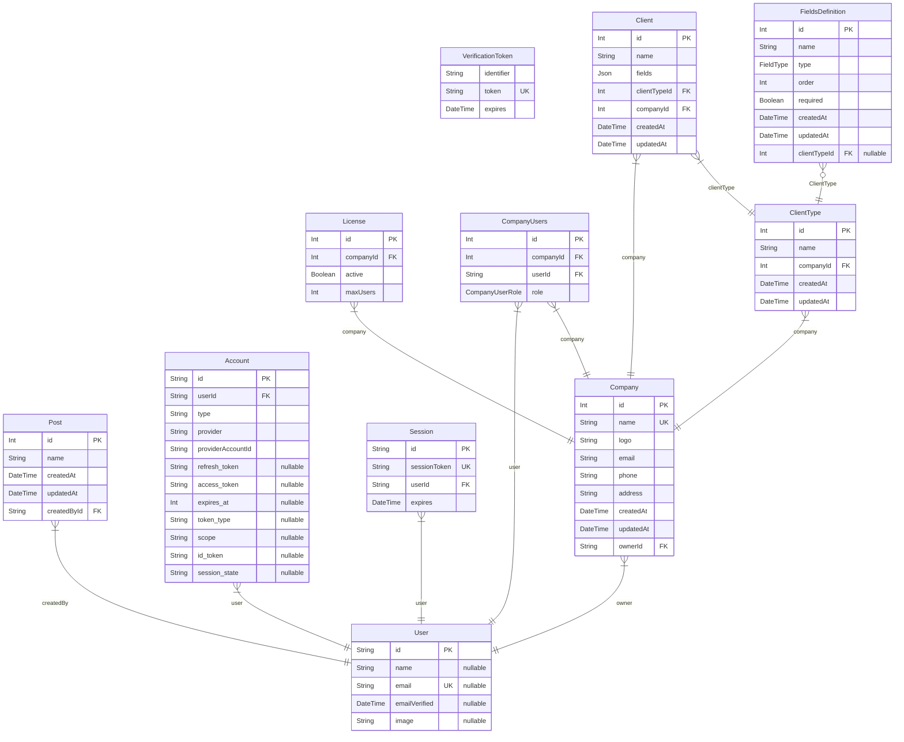

# Colera ERP
> Generated by [`prisma-markdown`](https://github.com/samchon/prisma-markdown)

- [default](#default)

## default

### `Post`

**Properties**
  - `id`: 
  - `name`: 
  - `createdAt`: 
  - `updatedAt`: 
  - `createdById`: 

### `Account`

**Properties**
  - `id`: 
  - `userId`: 
  - `type`: 
  - `provider`: 
  - `providerAccountId`: 
  - `refresh_token`: 
  - `access_token`: 
  - `expires_at`: 
  - `token_type`: 
  - `scope`: 
  - `id_token`: 
  - `session_state`: 

### `Session`

**Properties**
  - `id`: 
  - `sessionToken`: 
  - `userId`: 
  - `expires`: 

### `User`

**Properties**
  - `id`: 
  - `name`: 
  - `email`: 
  - `emailVerified`: 
  - `image`: 

### `VerificationToken`

**Properties**
  - `identifier`: 
  - `token`: 
  - `expires`: 

### `Company`

**Properties**
  - `id`: 
  - `name`: 
  - `logo`: 
  - `email`: 
  - `phone`: 
  - `address`: 
  - `createdAt`: 
  - `updatedAt`: 
  - `ownerId`: 

### `License`

**Properties**
  - `id`: 
  - `companyId`: 
  - `active`: 
  - `maxUsers`: 

### `CompanyUsers`

**Properties**
  - `id`: 
  - `companyId`: 
  - `userId`: 
  - `role`: 

### `ClientType`

**Properties**
  - `id`: 
  - `name`: 
  - `companyId`: 
  - `createdAt`: 
  - `updatedAt`: 

### `FieldsDefinition`

**Properties**
  - `id`: 
  - `name`: 
  - `type`: 
  - `order`: 
  - `required`: 
  - `createdAt`: 
  - `updatedAt`: 
  - `clientTypeId`: 

### `Client`

**Properties**
  - `id`: 
  - `name`: 
  - `fields`: 
  - `clientTypeId`: 
  - `companyId`: 
  - `createdAt`: 
  - `updatedAt`: 